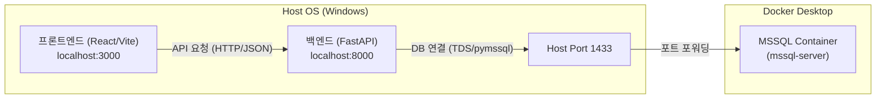

# MSSQL 연결 구조 가이드 (Local & Docker)

이 문서는 spMobile 프로젝트의 프론트엔드, 백엔드 및 Docker MSSQL 컨테이너 간의 연결 구조를 설명합니다.

## 1. 데이터 흐름도

---

## 2. 구성 요소별 상세 설명

### ① 프론트엔드 (Client)
- **위치**: `client/`
- **실행**: `npm run dev` (localhost:3000)
- **역할**: 사용자에게 UI를 제공합니다. "DB연결테스트(MCP)" 버튼 클릭 시 백엔드 API인 `GET /api/v1/system/mssql-mcp-check`를 호출합니다.

### ② 백엔드 (Server)
- **위치**: `server/`
- **실행**: `python -m server.main` (localhost:8000)
- **역할**: 전반적인 비즈니스 로직 및 DB 통신을 담당합니다.
- **연결 매커니즘**:
    - `.env` 파일의 설정을 참조하여 `pymssql` 라이브러리로 DB에 접속합니다.
    - 접속 주소는 `localhost:1433` (호스트의 1433 포트)을 사용합니다.

### ③ Docker MSSQL (Database)
- **이미지**: `mcr.microsoft.com/mssql/server:2022-latest`
- **컨테이너명**: `mssql-server`
- **포트 설정**: 컨테이너 내부의 TDS 포트(1433)를 호스트의 1433 포트로 매핑(Expose)합니다.
- **DB명**: `spMobileDB` (사용자 데이터 및 테스트용 데이터 포함)

---

## 3. 핵심 주의사항: 포트 충돌 이슈

Windows 환경에서 **로컬 SQL Server(Express/Standard 등)**가 설치되어 있는 경우, 서비스가 시작될 때 자동으로 호스트의 **1433 포트**를 점유합니다.

- **증상**: Docker 컨테이너가 정상 실행되더라도, 백엔드에서 `localhost:1433`으로 접속하면 Docker가 아닌 로컬 SQL Server로 연결되어 인증 실패(Error 18456)가 발생할 수 있습니다.
- **해결책**: 로컬 SQL Server 서비스를 중지하거나 제거하여 Docker 가 1433 포트를 독점적으로 사용할 수 있도록 설정해야 합니다.

---

## 4. MCP 서비스와의 관계
- **MCP 서버 컨테이너** (`mssql-mcp-server`): AI 에이전트가 DB에 접근할 수 있도록 돕는 인터페이스 서버(8080 포트)입니다.
- **연결 확인**: UI의 MCP 테스트 버튼은 시스템이 AI 서비스에 필요한 DB 자원에 정상적으로 접근 가능한지 최종적으로 체크하는 용도입니다.

---
*최종 업데이트: 2026-02-18 (운영 환경 검증 완료)*
